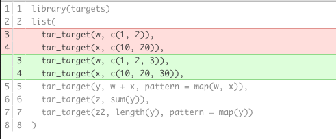

<style>
.inverse {
background-color: transparent;
text-shadow: 0 0 0px transparent;
}
.title-slide {
vertical-align: bottom !important; 
text-align: center !important;
}
.title-slide h1 {
position: absolute;
top: 0;
left: 0;
right: 0;
width: 100%;
line-height: 4em;
color: #666666;
}
.title-slide h3 {
line-height: 6em;
color: #666666;
}
.title-slide {
background-color: white;
background-image: url('images/logo.png');
background-repeat: no-repeat;
background-size: 25%;
}
.remark-slide-content:after {
content: "19-11-2021 (updated `r format(Sys.Date(), "%d-%m-%Y")`)";
position: absolute;
bottom: -5px;
left: 10px;
height: 40px;
width: 100%;
font-family: Helvetica, Arial, sans-serif;
font-size: 0.7em;
color: gray;
background-repeat: no-repeat;
background-size: contain;
}
</style>


```{r, message = FALSE, warning = FALSE, echo = FALSE}
#knitr::opts_knit$set(root.dir = fs::dir_create(tempfile()))
knitr::opts_chunk$set(collapse = TRUE, comment = "#>", eval = TRUE)
options(crayon.enabled = FALSE)

```

```{r, include = FALSE, message = FALSE}

library(fs)
library(targets)
library(tidyverse)
library(withr)
tar_destroy()
write_csv(airquality, "data/raw_data.csv")
file.copy("_targets_basic.R", "_targets.R", overwrite = TRUE)

options(
  warnPartialMatchArgs = FALSE,
  drake_clean_menu = FALSE,
  drake_make_menu = FALSE,
  htmltools.dir.version = FALSE
)

withr::with_dir("R", {
  tar_script({
    create_plot <- function(data) {
      ggplot(data) +
        geom_histogram(aes(x = Ozone)) +
        theme_gray(24)
    }
  })
  file_move("_targets.R", "functions.R")
})
```

## What is `targets`? 

- The targets R package is a [Make](https://www.gnu.org/software/make/)-like pipeline toolkit for Statistics and data science in R. 

--

- *Purpose*: maintain a reproducible workflow without repeating yourself.

--

- `targets` automatically learns how your pipeline fits together. 

--

- `targets` accelerates analysis with:
    - Easy-to-configure parallel computing.
    - Enhanced reproducibility.
    - Reduced burdens of repeated computation and manual data micromanagement.
--

- A fully up-to-date targets pipeline is tangible evidence that the output aligns with the code and data, which substantiates trust in the results. 

---

# Motivation

- Data science can be slow. 
--

- A single round of statistical computation can take several minutes, hours, or even days to complete. 
--

- Typical workflows looks like this: 
  1. Launch the code.
  2. Wait while it runs.
  3. Discover an issue.
  4. Restart from scratch.

--
- The `targets` R package keeps results up to date and reproducible while minimizing the number of expensive tasks that actually run. 

--
- `targets` arranges the steps of your pipeline, skips costly runtime for steps that are already up to date, runs the rest with optional implicit parallel computing, abstracts files as R objects, and shows tangible evidence that the output matches the underlying code and data. 

--
- In other words, the package saves time while increasing your ability to trust the results. 

--
- Most pipeline tolkits are not language specific or are Python-focused, while the `targts` package allows you to work complete in R. 

---

## Repetition: the overlooked bane of long computation

<br>


---

# Getting started 

Install the **`targets`**:

Type | Source | Command
---|---|---
Release | CRAN | `install.packages("targets")`
Development | GitHub | `remotes::install_github("ropensci/targets")`
Development | rOpenSci | `install.packages("targets", repos = "https://dev.ropensci.org")`

---

# File structure of a `targets` project

In a `targets` project, the parent folder **must** contain a `_targets.R` file and *typically* a `R/function.R` file. 

Otherwise, the project can be organized as you prefer, for example: 

```{r, eval = FALSE, include = TRUE}
├── _targets.R
├── R/
├──── functions.R
├── data/
└──── raw_data.csv
├── docs/
├── analysis/
├── output/
├── renv/
├── git/
README.md
.gitignore
```

---

# Target script file

- Files `raw_data.csv` and `functions.R` are typical user-defined components of a project-oriented workflow, but the target script file `_targets.R` file is special. 
--

- Every targets workflow needs a target script file to formally define the targets in the pipeline. 
--

- By default, the target script is a file called `_targets.R` in the project’s root directory. 
--

- Requirements: 
  1. Load the `targets` package.
  2. Load your custom function and global objects into the R session. 
  3. Call `tar_option_set()` to set the default settings for all you targets, such as the names of required packages and the data storage format. Individual targets can override these settings.
  4. Define individual targets with the `tar_target()` function. Each target is an intermediate step of the workflow. At minimum, a target must have a name and an R expression. 
  5. Every target script must end with a list of your tar_target() objects. 
  
---

An example `_targets.R` file: 

```{r, eval = FALSE, include = TRUE}
library(targets) # requirement 1: load the package.
source("R/functions.R") # requirement 2: load custom functions.
source("R/settings.R") # requirement 2: load custom settings.
tar_option_set(packages = c("biglm", "tidyverse")) 
# requirement 3: call `tar_option_set`.
list( # requirement 4: define all your targets with `tar_target()`. 
  tar_target( 
    raw_data_file,
    "data/raw_data.csv",
    format = "file"
  ),
  tar_target(
    raw_data,
    read_csv(raw_data_file, col_types = cols())
  ),
  tar_target(
    data,
    raw_data %>%
      filter(!is.na(Ozone))
  ),
  tar_target(hist, create_plot(data)),
  tar_target(fit, biglm(Ozone ~ Wind + Temp, data))
) # requirement 5: encapsulate all these targets in a list
```

---

## Inspect the pipeline

`tar_manifest()` shows you a data frame information about the targets, and it has functionality to specify the targets and columns returned.


```{r, eval = TRUE}
tar_manifest(fields = "command")
```

---

## Inspect the pipeline

There are also graphical displays with `tar_glimpse()`.

```{r, eval = TRUE}
tar_glimpse()
```

---

## Inspect the pipeline

For more comprehensive visualization, use: `tar_visnetwork()`.

```{r, eval = TRUE}
tar_visnetwork()
```

???

This DAG is indifferent to the order of targets in your pipeline. You will still get the same graph even if you rearrange them. This is because targets uses static code analysis to detect the dependencies of each target, and this process does not depend on target order. 

---

## Run the pipeline

The `tar_make()` function runs the workflow. 

--

It creates a fresh clean external R process, reads the target script to learn about the pipeline, runs the correct targets in the correct order given by the graph, and saves the necessary data to the `_targets/` data store.
--

```{r, eval = TRUE, warning = FALSE}
tar_make()
```

---

## Run the pipeline

The next time you run `tar_make()`, targets skips everything that is already up to date, which saves a lot of time in large projects with long runtimes.

```{r, eval = TRUE, warning = FALSE}
tar_make()
```

---

## Run the pipeline

We can use `tar_visnetwork()` and `tar_outdated()` to check ahead of time which targets are up to date.

```{r, eval = TRUE, warning = FALSE}
tar_outdated()
tar_visnetwork()
```

---

## Monitoring the pipeline

To monitor the build progress of your `targets` while `tar_make()` is running, you can open a new R session and run `tar_progress()`. 

It reads the spreadsheet in `_targets/meta/progress` and tells you which targets are running, built, errored, or cancelled.

```{r, eval = TRUE, include = FALSE}
tar_destroy()
tar_make()
```

```{r, eval = TRUE, warning = FALSE}
tar_progress()
```

---

## Changes to the pipeline

The `targets` package notices when you make changes to code and data, and those changes affect which targets rerun and which targets are skipped. 

If you change one of your *functions*, the targets that depend on it will no longer be up to date, and `tar_make()` will rebuild them. 

Below we change the function `create_plot` to include a `bins` parameter. 

```{r, eval = FALSE}
# Old functions.R.
create_plot <- function(data) {
    ggplot(data) + geom_histogram(aes(x = Ozone)) +
    theme_gray(24)
}

```


```{r, include = FALSE, eval = TRUE}
withr::with_dir("R", {
  tar_script({
    create_plot <- function(data) {
      ggplot(data) +
        geom_histogram(aes(x = Ozone), bins = 10) +
        theme_gray(24)
    }
  })
  file_move("_targets.R", "functions.R")
})
```

```{r, eval = FALSE}
# Edit functions.R.
create_plot <- function(data) {
  ggplot(data) +
    geom_histogram(aes(x = Ozone), bins = 10) + # Set number of bins
    theme_gray(24)
}
```

---

## Changes to the pipeline

`targets` detects the change. `hist` is outdated (as would be any targets downstream of hist) and the others are still up to date.

```{r, eval = TRUE, warning = FALSE}
tar_visnetwork()
tar_outdated()
```

---

## Changes to the pipeline

That means `tar_make()` reruns hist and nothing else.

```{r, eval = TRUE, warning = FALSE}
tar_make()
```

---

## Changes to the pipeline

- Similarly, if we change the data file `raw_data.csv`, `targets` notices the change. 
- This is because `raw_data_file` is a dynamic file (i.e. `tar_target(format = "file")`) that returned `"raw_data.csv"`. 
- Let’s try it out. Below, let’s use only the first 100 rows of the `airquality` dataset.

Recall that our first target looked like this, with `format = "file"`: 

```{r, eval = FALSE}
tar_target(
    raw_data_file,
    "data/raw_data.csv",
    format = "file",
    deployment = "main"
  )
```

---

## Changes to the pipeline

If we change data let's see what happens.

```{r, eval = TRUE, warning = FALSE}
write_csv(head(airquality, n = 100), "data/raw_data.csv")
tar_visnetwork()
```

Now everything is out of date, because the input file changed. 

---

## Reading targets

`targets` has a convenient functions `tar_read()` and `tar_load` to read your targets from the `_targets/` data store.

```{r, eval = TRUE, warning = FALSE}
tar_read(raw_data)
```

---

## Reading targets

```{r, eval = TRUE, warning = FALSE, out.width = "50%"}
tar_read(hist)
```

---

## Reading targets

```{r, eval = TRUE, warning = FALSE}

tar_load(raw_data)
ls()
raw_data
```

---

## Target construction

Like a good function, a good target generally does one of three things:

1. Create a dataset.
2. Analyze a dataset with a model.
3. Summarize an analysis or dataset.

If a function gets too long, split it into nested sub-functions that make your larger function easier to read and maintain.

Build up the pipeline *gradually*. 

---

## Target construction

The `targets` package automatically skips targets that are already up to date, so it is best to define targets that maximize time savings. Good targets usually:
--

- Are large enough to subtract a decent amount of runtime when skipped.
--

- Are small enough that some targets can be skipped even if others need to run.
--

- Invoke no side effects such as modifications to the global environment. (But targets with `tar_target(format = "file")` can save files.)
--

- Return a single value that is:
    - Easy to understand and interpret. 
    - Meaningful to the project. 
    - Easy to save as a file, e.g. with `readRDS()`. 

---

## Jobs outside of R

- Each target runs R code, so to invoke a tool outside R, use:
  - `system2()`
  - [`processx`](https://processx.r-lib.org) to call the appropriate system commands. 
- This allows you to run shell scripts, Python scripts, etc. from within R. 
- External scripts should ideally be tracked as input files using `tar_target(format = "file")`. 

---

## Branching

- Sometimes, a pipeline contains more targets than a user can comfortably type by hand. 

--

- For projects with hundreds of targets, branching can make the `_targets.R` file more concise and easier to read and maintain.

--

- **Dynamic branching**: used to define new targets (i.e. branches) while the pipeline is running. Prior to launching the pipeline, the user does not necessarily know which branches will spawn or how many branches there will be, and each branch’s inputs are determined at the last minute.

--

- **Static branching**: used when iterating over a known set of branches (or parameters) before the pipeline starts. 

---

## Branching patterns

To use dynamic branching, set the `pattern` argument of `tar_target()`. 

```{r, echo = FALSE, eval = TRUE, results = FALSE, message = FALSE}
file.copy("_targets_branch.R", "_targets.R", overwrite = TRUE)
```

```{r, eval = FALSE}
# _targets.R
library(targets)
list(
  tar_target(w, c(1, 2)),
  tar_target(x, c(10, 20)),
  tar_target(y, w + x, pattern = map(w, x)),
  tar_target(z, sum(y)),
  tar_target(z2, length(y), pattern = map(y))
)
```

---

## Branching patterns

Visualize the branched network.

```{r, eval = TRUE}
tar_visnetwork()
```

---

## Branching patterns

Build the pipeline. Notice the multiple `y_********` and `z2_********` targets that are created. 

```{r, eval = TRUE}
tar_make()
```

---

## Branching patterns

If we read target `y` into memory, all the branches will load and automatically aggregate as a vector. [Can also use list aggregation, write `tar_target(y, w + x, pattern = map(w, x), iteration = "list")` in the pipeline.]

```{r, eval = TRUE}
tar_read(y)
```

--

Target `z` accepts this entire aggregate of `y` and sums it.

```{r, eval = TRUE}
tar_read(z)
```

--

Target `z2` maps over `y`, so each each branch of `z2` accepts a branch of `y`.

```{r, eval = TRUE}
tar_read(z2)
```

---

## Branching patterns

You can also read individual branches, which is very helpful for debugging and development.

```{r, eval = TRUE}
tar_read(z2, branches = 1)
z2 <- tar_read(z2, branches = 1)

z2
```

---

## Branching patterns

Now you can easily run and develop some code interactively involving `z2`. 

Likely, your next target will involve a function with `z2` as an argument, and it will be easy to create and develop this function now that a template argument is loaded.

--

```{r, eval = FALSE}
manipulate_z2 <- function(z2){
  z2^2 
}
```

--

Once you are satisfied with your new function. You can add it to your `R/functions.R` file and add the target to the `_targets.R` document and rerun `tar_make()`.

```{r, eval = FALSE}
tar_target(
    z2_sq,
    manipulate_z2(z2),
    map(z2)
  )
```

---

## Revising a branched pipeline

```{r, echo = FALSE, eval = TRUE, results = FALSE, message = FALSE}
file.copy("_targets_branch2.R", "_targets.R", overwrite = TRUE)
```

If we add new branch(es) to the pipeline, only the new branches need to run even though the aggregate target `w` and `x` changed. 



---

## Revising a branched pipeline

Build the updated pipeline: 

```{r, eval = TRUE}
tar_make()
```

---

## Pattern construction

`targets` supports the following pattern types.

* `map()`: iterate over one or more targets in sequence.
* `cross()`: iterate over combinations of slices of targets.
* `slice()`: select individual branches slices by numeric index. For example, `pattern = slice(x, index = c(3, 4))` applies the target's command to the third and fourth slices (or branches) of upstream target `x`.
* `head()`: restrict branching to the first few elements.
* `tail()`: restrict branching to the last few elements.
* `sample()`: restrict branching to a random subset of elements.

---

## Pattern construction

These patterns can also be combined.  

Below, target `z` creates six branches, one for each combination of `w` and (`x`, `y`) pair. 

```{r, eval = FALSE}
# _targets.R
library(targets)
list(
  tar_target(w_comp, seq_len(2)),
  tar_target(x_comp, head(letters, 3)),
  tar_target(y_comp, head(LETTERS, 3)),
  tar_target(
    z_comp,
    data.frame(w = w_comp, x = x_comp, y = y_comp),
    pattern = cross(w_comp, map(x_comp, y_comp))
  )
)
```

---

## Branching over rows of data

`tarchetypes` >= 0.1.0 has helpers for easy branching over subsets of data frames if you have some very large data and the rows are all independent (i.e. only do this if are doing some row-based manipulations!).

* `tar_group_by()`: define row groups using `dplyr::group_by()` semantics.
* `tar_group_select()`: define row groups using `tidyselect` semantics.
* `tar_group_count()`: define a given number row groups.
* `tar_group_size()`: define row groups of a given size.

If you define a target with one of these functions, all downstream dynamic targets will automatically branch over the row groups.

---

## Debugging 

There are various options for debugging within a `targets` pipeline. 

Error and warning messages can be retrieved as follows: 

```{r, eval = FALSE}
tar_meta(fields = error, complete_only = TRUE)
tar_meta(fields = warnings, complete_only = TRUE)
```

More usefully, there is also both a **debug** and **workspaces** option for interactively debugging your target that errored out. 

---

## Debugging with workspaces

- A good option if you are running on a remote machine. 
- Using `tar_workspace()`, you can recover a target’s workspace and locally debug it even if the pipeline is not running.
- If you tell `targets` to record workspaces in advance, you can preempt errors and debug later at your convenience. 
- To enable workspaces, use the `workspace_on_error` and `workspaces` arguments of `tar_option_set()`.

--

Specifically, at the start of your `_targets.R` file, add the line: 

```{r, eval = FALSE}
tar_option_set(workspace_on_error = TRUE)
```

Now, when (if) your pipeline throws an error, you can easily debug it interactively. 

---

## Debugging with workspaces

An example pipeline with an error: 

```{r, eval = FALSE}
# _targets.R file:
options(tidyverse.quiet = TRUE)
library(targets)
tar_option_set(workspace_on_error = TRUE, packages = "tidyverse")
f <- function(arg) {
  stopifnot(arg < 4)
  print("Congratulations, your value is less than 4!")
}
list(
  tar_target(x, seq_len(4)), # 1 2 3 4
  tar_target(
    y,
    f(arg = x),
    pattern = map(x) 
  )
)
```


```{r, echo = FALSE, eval = TRUE, results = FALSE, message = FALSE}
file.copy("_targets_debug.R", "_targets.R", overwrite = TRUE)
tar_destroy()
```

---

Run the pipeline: 

```{r, eval = TRUE, error=TRUE}
tar_make()
```

One of the `y_********` targets errored out. 

---

## Debugging with workspaces

Since `y` did not build successfully, we cannot load or read it with `tar_load` or `tar_read`. 

```{r, eval = TRUE, error = TRUE}
tar_read(x)
tar_read(y)
```

--

But we can examine and debug the error now. First, double check which target failed (branched targets have cryptic names). 

```{r, eval = TRUE}
failed <- tar_meta(fields = error) %>%
  na.omit() %>%
  pull(name)
print(failed)
```

---

## Debugging with workspaces

Next, and more usefully, we use the `tar_workspace()` to read the special metadata in the workspace file, and load the target’s dependencies from various locations in `_targets/objects`. 

--

Specifically, this call will: 
- Maintain the same random number generator seed to the same as the target (useful if you are doing simulations!). 
- Load the required packages.
- Runs the target script file (default: `_targets.R`) to load other global object dependencies such as functions.

```{r, eval = TRUE}
tar_workspace(y_05f206d7)
```

---

## Debugging with workspaces

We now have the dependencies of `y_05f206d7` in memory, which allows us to try out any failed function calls in our local R session.

```{r, eval = TRUE, error = TRUE}
print(x)
arg
f(3)
f(x)
```

--

Now go back and edit `f()` accordingly, so it doesn't error next time. 

Once `f()` has changed, `targets`, will recognize this and your next call to `tar_make()` will try and rebuild `y`.

---

## High-performance computing

- `targets` supports high-performance computing with the `tar_make_clustermq()` and `tar_make_future()` functions. 

--

- These functions are like `tar_make()`, but they allow multiple targets to run simultaneously over parallel workers. 

--

- These workers can be processes on your local machine, or they can be jobs on a computing cluster. 

--

- The main process automatically sends a target to a worker as soon as:
    - The worker is available, and
    - All the target’s upstream dependency targets have been checked or built.

---

## High-performance computing with `clustermq`

**First**, create a template `sbatch` file in your root directory of your project (named `slurm_clustermq.tmpl`). 

```{r, eval = FALSE}
#!/bin/sh
# From https://github.com/mschubert/clustermq/wiki/SLURM
#SBATCH --job-name={{ job_name }}                         # job name
#SBATCH --partition={{ partition }}                       # partition
#SBATCH --output={{ log_file | /dev/null }}               # you can add .%a for array index
#SBATCH --error={{ log_file | /dev/null }}                # log file
#SBATCH --account={{ account }}                           # account
#SBATCH --array=1-{{ n_jobs }}                            # job array
#SBATCH --ntasks={{ ntasks }}
# module load R                                           # Uncomment if R is an environment module.

CMQ_AUTH={{ auth }} R --no-save --no-restore -e 'clustermq:::worker("{{ master }}")'
```

---

## High-performance computing with `clustermq`

**Second**, add a few settings to the top of you `_targets.R` file: 

```{r, eval = FALSE}
tar_option_set(
  resources = tar_resources(
    clustermq = tar_resources_clustermq(template = list(num_cores = 1, account = "sgg",
                                                        ntasks = 1, partition = "sgg",
                                                        log_file="/data/sgg2/jenny/projects/proxyMR/proxymr_%a_clustermq.out"))
  ),
  packages = c("tidyverse", "data.table", "MendelianRandomization"),
  error = "workspace",
  memory = "transient",
  storage = "worker",
  garbage_collection = TRUE
)
```

**Third**, run the pipeline as normal using:

`tar_make_clustermq(workers = 10)`. (or 120+ if you want to use all the cores on the sgg nodes!)

---

## Summary

- `targets` is an R based workflow manager which helps maintain a reproducible workflow and avoid rerunning long-running code. 

--

- Encourages good R practices like function-based workflows. 

--

- Excellent support from the maintainer on github. 

--

- Easy debugging. 

--

- Easy to scale up (i.e. add branches). 

--

- Seamless integration with slurm (no more creating `sbatch` files!).

--

- Good integration with `renv` (R package manager).

--

- Many other features I didn't mention! (including branch integration in github, multiple helpful features with R markdown documents, watch progress live with shiny).  

--

- **Considerations**: time-consuming to reformat your project if you are in the middle of a project, otherwise no real cons :) 

